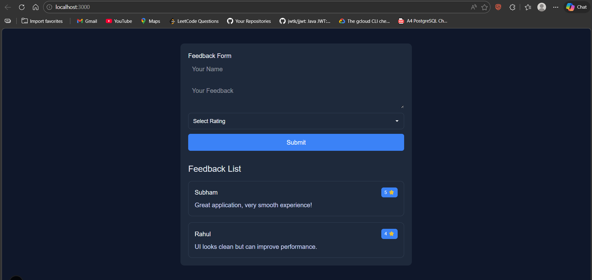

# 🚀 Feedback App (Next.js + Server Actions)

A simple full-stack feedback application built using Next.js App Router, demonstrating:

- Server Actions (no separate backend)
- Form handling using `FormData`
- State management with React hooks
- Clean UI with reusable components

---

## 📌 Features

- Submit feedback with:
  - Name
  - Message
  - Rating (1–5 ⭐)
- View list of feedbacks instantly
- In-memory data storage (for demo purposes)
- Responsive and clean UI

---

## 🏗️ Tech Stack

- Next.js (App Router)
- React (Hooks)
- TypeScript
- CSS (custom styling)

---

## 📁 Folder Structure

```

feedback-app/
│
├── src/
│   ├── app/
│   │   ├── page.tsx          # Main page (state + layout)
│   │   ├── layout.tsx        # Root layout
│   │   ├── globals.css       # Global styles
│   │
│   ├── actions/
│   │   └── feedback.ts       # Server actions (add/get feedback)
│   │
│   ├── components/
│   │   ├── FeedbackForm.tsx  # Form component
│   │   └── FeedbackList.tsx  # Feedback display
│   │
│   ├── style/
│   │   ├── FeedbackForm.css
│   │   └── FeedbackList.css
│
├── package.json
└── README.md

````

---

## ⚙️ Installation & Setup

```bash
# 1. Create project
npx create-next-app@latest feedback-app

# 2. Move into project
cd feedback-app

# 3. Install dependencies
npm install

# 4. Run the app
npm run dev
````

---

## 🌐 Run Locally

```
http://localhost:3000
```

---

## 🔄 How It Works

### 1. Page Load

* `page.tsx` loads initial feedbacks using `getFeedbacks()`

### 2. Form Submission

* Form sends `FormData`
* Calls server action `addFeedback()`

### 3. Server Processing

* Data stored in in-memory array
* Response returned to client

### 4. UI Update

* State updated using `setFeedbacks`
* List re-renders automatically

---

## 📸 Output Screenshot



---

## 🚀 Future Improvements

* Replace in-memory DB with MongoDB/PostgreSQL
* Add authentication (JWT/OAuth)
* Implement optimistic UI
* Add toast notifications
* Convert rating dropdown → star UI
* Add pagination / filtering

---

## 💡 Learning Outcomes

* Understanding of Next.js Server Actions
* Client vs Server components
* State management & data flow
* Component-based architecture

---

## 👨‍💻 Author

Subham